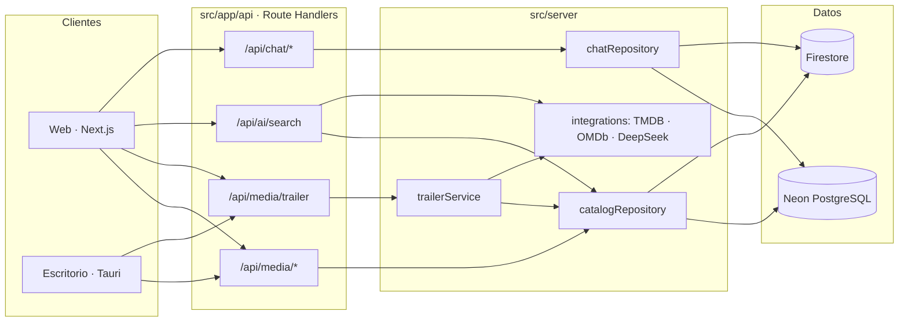

# streaming-Sntx

Catálogo cinematográfico de **más de 100.000 películas y series** para descubrir títulos a través de sus **tráilers oficiales**, con búsqueda en lenguaje natural asistida por IA, recomendaciones, listas personales y chat por título. Incluye una app web (Next.js) y un cliente de escritorio (Tauri) que consumen la misma API.

> streaming-Sntx no aloja ni enlaza contenido protegido: solo reproduce tráilers públicos de YouTube a través del reproductor embebido oficial.

## Funcionalidades

- **Tráilers oficiales**: cada título resuelve sus tráilers bajo demanda contra TMDB (preferencia: oficial en español → inglés → otros), con selector de versión y modo cine.
- **Catálogo de +113k títulos** en PostgreSQL (Neon), ingerido desde TMDB y TVmaze, con filtros por género, año y país, paginación por cursor y búsqueda tolerante a acentos.
- **Búsqueda con IA**: describe una escena, actor o época y el asistente (DeepSeek) identifica el título y lo cruza con el catálogo.
- **Tendencias** basadas en las vistas del propio catálogo, con estrenos populares como respaldo.
- **Mi lista** sincronizada en Firestore para usuarios autenticados (Firebase Auth).
- **Chat por título** con moderación, nombres de usuario generados y límites de uso.
- **Cliente de escritorio** (Tauri + Vite + React + TypeScript).

## Stack

| Capa | Tecnología |
|------|------------|
| Web | Next.js 16 (App Router), React 19, Tailwind CSS 4, Framer Motion, Zustand |
| API | Next.js Route Handlers (Node.js runtime) |
| Datos | PostgreSQL (Neon) · Firestore · proveedores intercambiables |
| Integraciones | TMDB, TVmaze, OMDb, DeepSeek, YouTube embed |
| Auth | Firebase Auth + Firebase Admin (verificación de tokens en servidor) |
| Escritorio | Tauri 2, Vite, TypeScript |
| Deploy | Vercel |

## Arquitectura

Monolito modular por capas: la interfaz se organiza por **dominio funcional** y todo el código de servidor vive aislado en `src/server/`, detrás de repositorios con proveedores intercambiables.



### Estructura

```text
src/
├── app/                 Rutas: páginas y API Route Handlers (capa HTTP delgada)
├── features/            Código de cliente agrupado por dominio
│   ├── ai-search/       Búsqueda en lenguaje natural
│   ├── auth/            Modal y store de autenticación
│   ├── catalog/         Hero, filas, tarjetas, compartir, store del catálogo
│   ├── chat/            Chat por título y panel de moderación
│   ├── donations/       Botón, franja y modal de donaciones
│   ├── favorites/       Store de "Mi lista" (localStorage + Firestore)
│   └── trailers/        Reproductor de tráilers y hook useTrailers
├── components/          UI compartida: layout (Navbar, Footer) y primitivas
├── server/              Solo servidor (protegido con `server-only`)
│   ├── catalog/         Repositorio + proveedores neon / firebase / tmdb / demo
│   ├── chat/            Repositorio + proveedores, autorización de moderación
│   ├── trailers/        Resolución y caché de tráilers
│   ├── integrations/    Clientes TMDB, OMDb, DeepSeek
│   ├── db/              Clientes Postgres y Firebase Admin
│   ├── http/            Rate limiting
│   └── config/          Selección de proveedores por entorno
└── lib/                 Utilidades isomórficas (youtube, géneros, firebase cliente)
db/migrations/           Esquema SQL e índices de Neon
scripts/                 Ingesta (TMDB, TVmaze), migraciones y utilidades
desktop/                 Cliente de escritorio Tauri
docs/                    Guías de Neon, Firebase y moderación
```

**Decisiones clave**

- **Repositorios con proveedores intercambiables**: las rutas solo conocen `catalogRepository` / `chatRepository`; el backend concreto (Neon, Firestore, TMDB en vivo o datos demo) se elige con `CATALOG_PROVIDER` / `CHAT_PROVIDER`. El proyecto arranca sin ninguna credencial en modo `demo`.
- **Límite cliente/servidor explícito**: cada módulo de `src/server/` importa `server-only`, así que importarlo desde un componente de cliente rompe el build en lugar de filtrar secretos al navegador.
- **Tráilers sin escribir en la base**: solo ~7% del catálogo trae el tráiler guardado. `trailerService` lo resuelve con el mejor identificador disponible (id TMDB → IMDb/TheTVDB del payload de ingesta → búsqueda por título y año), lo cachea en memoria (TTL corto para resultados vacíos) y en el CDN vía `Cache-Control`.
- **Protección de la API**: rate limiting por IP y endpoint, verificación de ID tokens de Firebase en servidor y CSP que solo permite iframes de YouTube y Firebase Auth.

## Puesta en marcha

Requisitos: **Node.js 20+**. Todo lo demás es opcional: sin variables de entorno la app funciona con el catálogo demo.

```bash
git clone https://github.com/santyxswc/streaming-Sntx.git
cd streaming-Sntx
npm install
cp .env.example .env.local   # rellena lo que vayas a usar
npm run dev                  # http://localhost:3000
```

### Catálogo en Neon

```bash
npm run migrate:neon                                   # aplica db/migrations/
npm run ingest:tmdb -- --type=movie --max-pages=20     # películas desde TMDB
npm run ingest:tvmaze -- --pages=5                     # series desde TVmaze
```

Más detalle en [docs/CATALOG_NEON.md](docs/CATALOG_NEON.md).

### Escritorio

```bash
cd desktop
cp .env.example .env         # VITE_API_URL + VITE_FIREBASE_*
npm install
npm run tauri dev
```

Ver [desktop/README.md](desktop/README.md).

## Variables de entorno

Todas están listadas en [`.env.example`](.env.example). Las principales:

| Variable | Uso |
|----------|-----|
| `CATALOG_PROVIDER` | `neon` · `firebase` · `tmdb` · `demo` |
| `DATABASE_URL` | Conexión PostgreSQL (solo servidor) |
| `TMDB_API_KEY` | Resolución de tráilers, fichas y búsqueda externa |
| `DEEPSEEK_API_KEY` | Búsqueda con IA |
| `NEXT_PUBLIC_FIREBASE_*` | Auth y favoritos en el cliente |
| `FIREBASE_SERVICE_ACCOUNT_BASE64` | Verificación de tokens en servidor ([guía](docs/FIREBASE_SERVICE_ACCOUNT.md)) |
| `CHAT_PROVIDER`, `CHAT_MODERATION_SECRET`, `CHAT_ADMIN_UIDS` | Chat y moderación ([guía](docs/CHAT_MODERATION.md)) |
| `INGEST_SECRET_KEY` | Protege `POST /api/ingest/tmdb` (cabecera `x-api-key`) |

## Scripts

| Comando | Descripción |
|---------|-------------|
| `npm run dev` | Servidor de desarrollo |
| `npm run build` / `npm start` | Build y servidor de producción |
| `npm run lint` | ESLint |
| `npm run migrate:neon` | Migraciones SQL |
| `npm run ingest:tmdb` | Ingesta desde TMDB (variantes `:movie:full`, `:series:full`, `:es:full`) |
| `npm run ingest:tvmaze` | Ingesta de series desde TVmaze (`:full` para el catálogo completo) |

## API

| Endpoint | Descripción |
|----------|-------------|
| `GET /api/media` | Listado paginado con filtros y orden |
| `GET /api/media/detail` | Ficha de un título |
| `GET /api/media/trailer` | Tráilers de YouTube de un título |
| `GET /api/media/episodes` | Temporadas y episodios de una serie |
| `GET /api/media/search` · `/multi-search` | Búsqueda en catálogo y TMDB |
| `GET /api/media/recommendations` | Más títulos del mismo tipo |
| `GET /api/media/metadata` | Años y países disponibles para filtros |
| `POST /api/ai/search` | Identificación de títulos por descripción |
| `/api/chat/*` | Mensajes, perfiles y moderación |
| `GET /api/health/db` | Estado del proveedor de catálogo |

## Licencia

[MIT](LICENSE) © santyxswc
