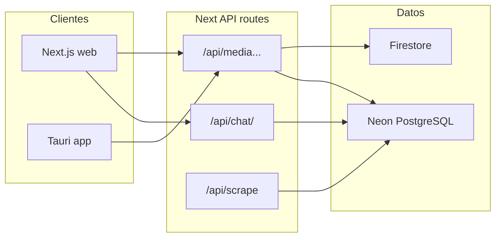

# Luvana — plataforma de streaming (Next.js)

Luvana es, en esencia, un **clon de la experiencia de Netflix**: misma lógica de presentación (filas, detalle, reproductor, búsqueda) y una capa visual pensada para recordar a ese tipo de plataformas, que es justo lo que suele atraer la curiosidad. No es un producto oficial ni un cliente de Netflix: el catálogo y las fichas se **rellenan con datos obtenidos por scraping/ingest** (incluidos enlaces a streams de terceros para películas y series) y viven en tu propia base (Firebase/Neon según configuración).

Este repositorio se publica para **experimentación y aprendizaje** — ver cómo encajar un front “tipo streaming premium” con Next.js App Router, auth con Firebase, backend en rutas API, chat opcional en Neon y app de escritorio con Tauri.

**Aviso:** el despliegue, el origen de los enlaces, el scraping y el cumplimiento legal (derechos de contenido, términos de sitios de terceros, etc.) son **responsabilidad de quien instale o despliegue** el proyecto. No se incluyen credenciales ni datos de producción en el código.

## Requisitos

- **Node.js** 20+ (recomendado; la versión exacta puede alinearse con la de Vercel).
- Cuenta **Firebase** (Auth + Firestore para el flujo cliente; service account para las API del servidor).
- Opcional: proyecto **Neon** (Postgres) si usas el catálogo o el chat vía `CATALOG_PROVIDER` / `CHAT_PROVIDER` (ver [docs/CATALOG_NEON.md](docs/CATALOG_NEON.md)).
- Opcional: **DeepSeek** API key para funcionalidades que llaman a IA ([src/lib/deepseek.js](src/lib/deepseek.js)).

## Instalación local (web)

```bash
git clone https://github.com/sicksides88/luvana-app.git
cd luvana
npm install
cp .env.example .env.local
# Edita .env.local con tus valores (Firebase, etc.)
npm run dev
```

Abre [http://localhost:3000](http://localhost:3000). Las variables se documentan en [`.env.example`](.env.example) y en la tabla de despliegue más abajo.

### Base de datos Neon (migraciones)

Si usas Postgres para catálogo y/o chat:

```bash
npm run migrate:neon
```

Aplica los SQL de [`db/migrations/`](db/migrations/). Detalles: [docs/CATALOG_NEON.md](docs/CATALOG_NEON.md).

## Cómo está construido

| Ruta | Contenido |
|------|------------|
| [`src/app/`](src/app/) | App Router: páginas, layout y **API Routes** bajo `src/app/api/`. |
| [`src/lib/`](src/lib/) | Cliente Firebase, Neon SQL, chat, DeepSeek, moderación, etc. |
| [`src/services/`](src/services/) | Lógica de negocio (scraper, acceso a datos). |
| [`db/migrations/`](db/migrations/) | Esquema SQL para Neon. |
| [`scripts/`](scripts/) | Ingesta, migraciones, utilidades. |
| [`desktop/luvana-desktop/`](desktop/luvana-desktop/) | App **Tauri + Vite + React** que consume la misma API. |
| [`docs/`](docs/) | Neon, service account, moderación de chat, etc. |

Flujo resumido:



### Scraping e ingesta del catálogo

El front “tipo Netflix” consume un catálogo que tú rellenas; la pieza que **obtiene metadatos y enlaces de reproducción** vive en el servidor:

| Pieza | Rol |
|--------|-----|
| [`src/services/scraper.js`](src/services/scraper.js) | Lógica de scraping: descarga y normaliza datos de títulos y enlaces a streams. |
| [`src/app/api/scrape/route.js`](src/app/api/scrape/route.js) | `POST /api/scrape`: recibe el trabajo de scrape (protegido con `x-api-key` / `SCRAPE_SECRET_KEY`) y persiste en tu base. |
| [`scripts/ingest-la-movie.mjs`](scripts/ingest-la-movie.mjs) | Script de ingesta que llama a la API de scrape (útil en local o contra un despliegue). |

En [docs/CATALOG_NEON.md](docs/CATALOG_NEON.md) tienes el detalle de `POST /api/scrape` (cabecera `x-api-key`, tipos y límites) y el flujo con Neon. Sin datos ingeridos, la UI puede verse vacía: configura el entorno, la base y ejecuta el scrape o el script de ingest según te convenga.

## Aplicación de escritorio

Cliente opcional (Rust/Tauri + Vite). Instrucciones: [desktop/luvana-desktop/README.md](desktop/luvana-desktop/README.md). Copia `desktop/luvana-desktop/.env.example` y define al menos `VITE_API_URL` y las variables `VITE_FIREBASE_*` alineadas con el mismo proyecto Firebase que la web.

## Despliegue (Vercel)

El proyecto está orientado a **Vercel** (`@vercel/analytics` en el layout). Configura las variables en **Project → Settings → Environment Variables**.

| Variable | Descripción |
| :--- | :--- |
| `NEXT_PUBLIC_FIREBASE_API_KEY` | API Key de Firebase (cliente) |
| `NEXT_PUBLIC_FIREBASE_AUTH_DOMAIN` | Auth domain |
| `NEXT_PUBLIC_FIREBASE_PROJECT_ID` | Project ID |
| `NEXT_PUBLIC_FIREBASE_STORAGE_BUCKET` | Storage bucket |
| `NEXT_PUBLIC_FIREBASE_MESSAGING_SENDER_ID` | Sender ID |
| `NEXT_PUBLIC_FIREBASE_APP_ID` | App ID |
| `NEXT_PUBLIC_SITE_URL` | URL canónica (OG/metadata); en un fork usa tu dominio. Por defecto en código: referencia a despliegue de ejemplo. |
| `NEXT_PUBLIC_CAFECITO_USERNAME` | Opcional: usuario Cafecito para donaciones. |
| `FIREBASE_SERVICE_ACCOUNT` o `FIREBASE_SERVICE_ACCOUNT_BASE64` | Service account para verificar tokens en servidor. Mismo `project_id` que `NEXT_PUBLIC_*`. Ver [docs/FIREBASE_SERVICE_ACCOUNT.md](docs/FIREBASE_SERVICE_ACCOUNT.md). |
| `DEEPSEEK_API_KEY` | API de DeepSeek. |
| `SCRAPE_SECRET_KEY` | **Obligatoria en producción** para `POST /api/scrape` (cabecera `x-api-key`). Con `next dev` puedes no definirla (solo entorno de desarrollo). |
| `CATALOG_PROVIDER` | `firebase` o `neon` (si defines `DATABASE_URL` sin `CATALOG`, puede inferirse Neon: ver `src/lib/catalogEnv.js`). |
| `DATABASE_URL` o `NEON_DATABASE_URL` | Conexión Postgres (solo servidor). |
| `CHAT_PROVIDER` | `neon` (por defecto) o `firebase`. |
| `CHAT_MODERATION_SECRET` / `CHAT_ADMIN_UIDS` | Moderación: [docs/CHAT_MODERATION.md](docs/CHAT_MODERATION.md). |

- **Build:** `npm run build` — salida: `.next`.
- Tras añadir tablas de chat en Neon, ejecuta `npm run migrate:neon` si aplica.

### Reglas de Firestore (ejemplo: lectura pública solo al catálogo)

Ajusta a tu política. Ejemplo mínimo para **solo lectura** en listados de películas/series y denegar el resto:

```javascript
rules_version = '2';
service cloud.firestore {
  match /databases/{database}/documents {
    match /movies/{movie} {
      allow read: if true;
      allow write: if false;
    }
    match /series/{serie} {
      allow read: if true;
      allow write: if false;
    }
    match /{document=**} {
      allow read, write: if false;
    }
  }
}
```

## Comandos útiles

| Comando | Uso |
|--------|-----|
| `npm run dev` | Servidor de desarrollo. |
| `npm run build` / `npm run start` | Producción local. |
| `npm run lint` | ESLint. |
| `npm run migrate:neon` | Migraciones SQL a Neon. |
| `npm run ingest:la-movie` | Ingesta vía `POST /api/scrape` (lee `.env.local`; ver script). |

## Documentación adicional

- [docs/CATALOG_NEON.md](docs/CATALOG_NEON.md) — catálogo en Neon, scrape, `DATABASE_URL`.
- [docs/FIREBASE_SERVICE_ACCOUNT.md](docs/FIREBASE_SERVICE_ACCOUNT.md) — credenciales de administrador.
- [docs/CHAT_MODERATION.md](docs/CHAT_MODERATION.md) — panel de moderación y secretos.
- [SECURITY.md](SECURITY.md) — reporte responsable de vulnerabilidades.
- [LICENSE](LICENSE) — licencia MIT.

## Checklist antes de publicar en GitHub

- Revisar el **historial de Git** por `.env` o JSON de service account cometidos por error (herramientas como [gitleaks](https://github.com/gitleaks/gitleaks) o auditoría manual); si hubo fuga, **rota** las claves.
- Añade **topics** al repo, por ejemplo: `nextjs`, `react`, `firebase`, `neon`, `postgresql`, `tauri`, `vercel`, `streaming`.
- Comprueba que no queden **secretos en Issues, Actions ni foros** del proyecto.

## Tecnologías (resumen)

- **Web:** Next.js (App Router), React, Tailwind CSS, Framer Motion, Zustand, Lucide.
- **Auth / datos:** Firebase; Postgres opcional vía **Neon**; integración con **DeepSeek** para IA.
- **Escritorio:** Tauri, Vite, TypeScript (carpeta `desktop/`).

---

© 2026 Luvana. Proyecto publicado bajo [licencia MIT](LICENSE).
