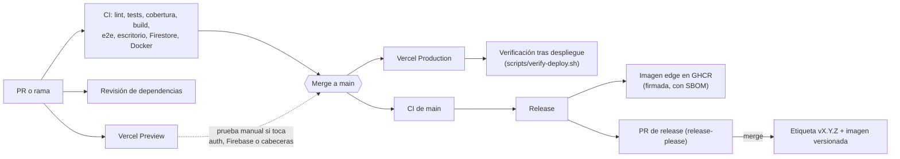

# Flujo de entrega y promoción a producción

Cómo llega un cambio desde un commit hasta producción, qué se comprueba por el camino y cómo volver atrás.
Lo que ocurre solo está automatizado; lo que hace una persona está marcado como **manual**.

## Flujo



| Etapa | Qué pasa | Quién |
|---|---|---|
| PR | CI completo, revisión de dependencias y un Preview de Vercel (protegido: se abre con la cuenta de Vercel) | Automático |
| Antes de fusionar | Si el cambio toca **login, Firebase, CSP o cabeceras**, prueba el Preview: inicia sesión, recarga (la sesión debe seguir), añade y quita un favorito y revisa la consola (F12) sin `Content Security Policy` ni `permission-denied` | **Manual** |
| Merge a `main` | Vercel despliega a producción; el CI corre otra vez sobre `main` | Automático |
| Tras el despliegue | `post-deploy.yml` ejecuta `scripts/verify-deploy.sh`; si falla, abre una incidencia `deploy` | Automático |
| Después | `release.yml` (solo si el CI de `main` está en verde) publica la imagen `edge` y mantiene el PR de release | Automático |
| Release | Fusionar el PR de release crea la etiqueta, la release de GitHub y la imagen versionada | **Manual** (un clic) |

Los PR que abre release-please los crea el `GITHUB_TOKEN`, y GitHub no ejecuta el CI en ellos; el CI corre sobre `main` al fusionarlos.

## Checklist de promoción

Es la sección 4 del [runbook](RUNBOOK.md) hecha ejecutable. Desde tu máquina:

```bash
scripts/verify-deploy.sh                      # producción
scripts/verify-deploy.sh http://localhost:3100  # un build local
```

Comprueba 11 cosas, todas de solo lectura: `health` y `health/db`; las cabeceras de la home (CSP sin `unsafe-eval` ni
comodines de Google/Firebase, `object-src 'none'`, `frame-ancestors 'none'`, `X-Frame-Options: DENY`, `nosniff`, sin
`X-Powered-By`, HSTS); la página puente `/embed` (solo Tauri puede enmarcarla, sin `X-Frame-Options`, 404 con ids
inválidos); 404 en rutas de API inexistentes; la página de privacidad; que la ingesta rechaza peticiones sin clave; y el CORS
(abierto solo en las rutas públicas de lectura). Reintenta unos segundos porque el borde de Vercel puede tardar en servir la
versión nueva.

Lo que **no** cubre y conviene mirar tras un cambio grande (manual): iniciar sesión y usar «Mi lista», enviar un mensaje en el
chat, y que el tráiler de la portada se reproduce.

## Entornos

| | Producción | Preview (PR y ramas) |
|---|---|---|
| Origen | `main` | Cualquier otra rama |
| Acceso | Público | Protegido con Vercel Authentication |
| Variables | Todas | Solo `NEXT_PUBLIC_FIREBASE_*` y las de Upstash (`KV_*`) |
| Catálogo | Neon | Demo (sin `DATABASE_URL`) |
| Secretos de producción (`INGEST_SECRET_KEY`, cuenta de servicio, `TMDB_API_KEY`) | Sí | **No, a propósito** |

Probar un Preview protegido desde la terminal: `vercel curl <ruta> --deployment <url-del-preview>`.

## Rollback

| Qué se rompió | Cómo volver atrás |
|---|---|
| Un despliegue web | Vercel → Deployments → el último bueno → **⋯ → Instant Rollback**. Después, `git revert <sha>` y push, o `main` seguirá conteniendo el cambio malo. Detalle en el [playbook 1](RUNBOOK.md) |
| La imagen Docker | Las etiquetas versionadas no cambian: usa la versión anterior (`ghcr.io/santyxswc/streaming-sntx:0.2.0`). Verifica su firma según [SUPPLY_CHAIN.md](SUPPLY_CHAIN.md) |
| Las reglas de Firestore | Consola de Firebase → Firestore → Reglas → historial → restaurar la versión anterior |
| Una variable de entorno | Vercel → Environment Variables → restaura el valor y redespliega |

## Decisiones

**`vercel.json` / `vercel.ts`: no se añade.** Se evaluó con datos: las funciones corren en `iad1` (Washington) y Neon está en
`us-east-1` (Virginia), la misma zona de AWS, así que fijar la región no mejora la latencia; no hay cron jobs; la duración por
defecto (300 s) sobra para las rutas de lectura, y la ingesta masiva se ejecuta con scripts locales, no desde Vercel. Se
reconsiderará si cambia alguna de esas condiciones.

**Tiempo máximo en llamadas externas.** TMDB y OMDb tienen un tope de 8 s (`EXTERNAL_API_TIMEOUT_MS`) para que un proveedor
colgado no retenga una función hasta su límite.

**Protección de `main`.** Hoy el ruleset «Proteger Main» bloquea el borrado y el force push, pero **no exige PR ni CI en
verde**: permite subir directamente. Es una decisión consciente (proyecto de una persona, flujo de commits agrupados). Las
consecuencias son reales: un commit que rompa el CI llega a producción. Lo que lo compensa es `post-deploy.yml`, que detecta el
fallo y abre una incidencia, y el rollback de arriba. Si se quisiera endurecer: exigir los checks del CI y un PR, con la
persona mantenedora como *bypass actor* (los PR de release-please no ejecutan el CI, así que sin bypass quedarían bloqueados).
