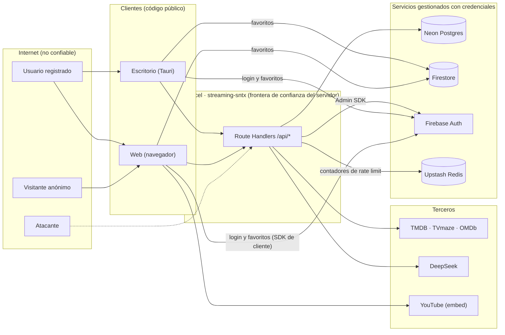

# Modelo de amenazas — streaming-Sntx

- **Fecha:** 2026-09-30
- **Método:** STRIDE por componente, más casos de abuso (coste, spam, privacidad).
- **Relación con otros documentos:** los hallazgos concretos y su corrección están en
  [security-audit.md](security-audit.md) (`SEC-xx`). La respuesta a incidentes está en
  [RUNBOOK.md](RUNBOOK.md). Este documento explica **qué se protege, de quién y con qué controles**;
  cada amenaza remite al control real del código o de la configuración.
- **Cuándo revisarlo:** al añadir una ruta de API, una integración externa o un secreto, y como mínimo
  cada trimestre.

## 1. Qué es el sistema

Catálogo de películas y series que reproduce **solo tráilers oficiales** de YouTube. Tiene una web
(Next.js en Vercel) y un cliente de escritorio (Tauri) que consumen la misma API. Los usuarios se
registran con Firebase Auth, guardan favoritos en Firestore y conversan en un chat por título
(Postgres en Neon). Una búsqueda con IA (DeepSeek) identifica títulos a partir de una descripción.

**Frontera de confianza principal:** todo lo que llega del navegador o del escritorio es entrada no
confiable. El código de los clientes es público, así que no contiene secretos: las claves
`NEXT_PUBLIC_*` (incluida la clave web de Firebase) son públicas por diseño.

## 2. Activos

| Activo | Dónde vive | Impacto si se compromete |
|---|---|---|
| Cuenta de servicio de Firebase (`FIREBASE_SERVICE_ACCOUNT_BASE64`) | Variable secreta en Vercel | **Crítico.** El Admin SDK se salta las reglas de Firestore y gestiona usuarios de Auth. |
| `DATABASE_URL` (Neon) | Variable secreta en Vercel | **Crítico.** Lectura y escritura completa de catálogo, chat y perfiles. |
| Credenciales y correo de los usuarios | Firebase Auth (gestionado por Google) | Alto. Datos personales. |
| Mensajes de chat y apodos (`chat_messages`, `chat_user_profiles`) | Neon | Medio. Contenido público de sala, pero vinculado a un `uid`. **No es reproducible.** |
| Favoritos (`users/{uid}/userData/watchlist`) | Firestore | Bajo. Preferencias del usuario. |
| Vistas de contenido (`media_views`) | Neon | Bajo. |
| Catálogo (`media`) | Neon | Bajo. Público y **reproducible** desde TMDB/TVmaze con los scripts de ingesta. |
| Claves de terceros (`TMDB_API_KEY`, `DEEPSEEK_API_KEY`, `OMDB_API_KEY`) | Variables secretas en Vercel | Medio. Coste económico o cuota agotada. |
| `INGEST_SECRET_KEY`, `CHAT_MODERATION_SECRET`, `CHAT_ADMIN_UIDS` | Variables en Vercel | Alto. Permiten escribir en el catálogo o acceder a la moderación. |
| Token de Upstash (`KV_REST_API_TOKEN`) | Variable secreta en Vercel | Bajo. Solo contadores de rate limit. |
| Repositorio, Actions y Dependabot | GitHub | Alto. Integridad de lo que se despliega (cadena de suministro). |
| Disponibilidad y coste | Vercel, Neon, DeepSeek | Medio. Un abuso puede agotar cuotas gratuitas. |

## 3. Actores

| Actor | Capacidad |
|---|---|
| Visitante anónimo | Llama a las rutas públicas de lectura. |
| Usuario registrado | Además: escribe en el chat, guarda favoritos, cambia su apodo. |
| Usuario malicioso registrado | Puede llamar a Firebase directamente sin pasar por la interfaz. |
| Moderador | UID en `CHAT_ADMIN_UIDS` o poseedor de `CHAT_MODERATION_SECRET`. Hoy no configurado en producción. |
| Atacante externo | Solo dispone de lo público: URLs, código de los clientes, claves `NEXT_PUBLIC_*`. |
| Dependencia o acción de terceros comprometida | Ejecuta código en el build, en el CI o en el servidor. |
| Mantenedor | Único administrador. Su cuenta de GitHub, Vercel, Neon y Firebase es un objetivo. |

## 4. Superficie de ataque

| Punto de entrada | Autenticación | Controles principales |
|---|---|---|
| `GET /api/feed/*`, `/api/media/*` | Ninguna (lectura pública) | Rate limit por IP, validación de parámetros, caché CDN, CORS abierto solo aquí |
| `POST /api/ai/search` | Ninguna | 5/min por IP, entrada ≤ 300 caracteres, `timeout` y `max_tokens` |
| `POST /api/auth/limit` | Ninguna | Límite de mejor esfuerzo (no es un control de seguridad) |
| `GET /api/auth/admin` | Bearer de Firebase | Lista blanca de UIDs, comprobación de revocación |
| `GET/POST /api/chat/*` | Bearer de Firebase (escritura) | Verificación de token, `checkRevoked` al escribir, límites por IP y por uid, 500 caracteres |
| `GET /api/chat/moderation/messages` | Bearer + UID en lista, o `X-Moderation-Secret` | `timingSafeEqual`, lista blanca, 503 si no está configurada |
| `POST /api/ingest/tmdb` | Cabecera `x-api-key` | `timingSafeEqual`, límite de intentos fallidos, respuestas genéricas |
| `GET /api/health`, `/api/health/db` | Ninguna | Liveness sin dependencias; readiness con rate limit y caché |
| Firebase Auth y Firestore (SDK de cliente) | Sesión de Firebase | Reglas de Firestore, política de Auth (SEC-09) |
| Imagen Docker | — | Sin secretos, usuario no root, solo lectura, escaneo con Trivy |
| GitHub (código, Actions, Dependabot) | Cuenta del mantenedor | Acciones fijadas por SHA, permisos mínimos, gitleaks, CodeQL |

## 5. Análisis STRIDE

Columna **Residual**: riesgo que queda con los controles actuales. Las referencias `SEC-xx` apuntan al
informe de auditoría.

### 5.1 Web y API

| ID | Amenaza | Cat. | Controles existentes | Residual |
|---|---|---|---|---|
| T-01 | Inyección SQL en rutas con parámetros | T, E | Consultas con plantillas etiquetadas de `postgres` (sin `sql.unsafe` ni concatenación); cursores validados como UUID; longitudes acotadas | Bajo |
| T-02 | XSS (robo de sesión, acciones en nombre del usuario) | T, I | React escapa el contenido; sin `dangerouslySetInnerHTML`; CSP sin `unsafe-eval` en producción; `object-src 'none'` | **Medio-bajo:** `script-src` mantiene `'unsafe-inline'` (SEC-11) |
| T-03 | Clickjacking | S | `X-Frame-Options: DENY` y `frame-ancestors 'none'` | Bajo |
| T-04 | Otro sitio lee respuestas de rutas privadas desde el navegador de la víctima | I | CORS solo en `/api/media`, `/api/feed`, `/api/auth/limit`; el resto no emite cabeceras CORS (SEC-01) | Bajo |
| T-05 | Denegación de servicio por volumen | D | Rate limit por IP con almacén compartido (SEC-03); caché CDN en lecturas; mitigación de DDoS de red de Vercel | **Medio:** sin WAF propio; la protección de aplicación depende del rate limit |
| T-06 | Fuga de información en mensajes de error | I | Errores genéricos al cliente; detalle solo en logs del servidor (SEC-05, SEC-06) | Bajo |
| T-07 | Evadir el rate limit falsificando la IP | S | Según la documentación de Vercel, la plataforma establece `x-forwarded-for`; respaldo a `x-real-ip` | Bajo en Vercel; **en local o tras otro proxy la cabecera es falsificable** |

### 5.2 Identidad y sesión

| ID | Amenaza | Cat. | Controles existentes | Residual |
|---|---|---|---|---|
| T-08 | Fuerza bruta o credential stuffing contra el login | S | Limitación propia de Firebase Auth; `/api/auth/limit` solo frena el formulario | Bajo. Política de contraseñas en modo *Exigir* activa en la consola y verificada contra Firebase (SEC-09); sigue sin haber límite propio para quien llama directo a Firebase |
| T-09 | Enumeración de correos registrados | I | Protección contra enumeración de correos activa en Firebase (SEC-09); login y registro devuelven `INVALID_LOGIN_CREDENTIALS` | Bajo |
| T-10 | Robo o reutilización de un token de sesión | S | Tokens de ~1 h; `checkRevoked` en envío de mensajes, moderación y `auth/admin` (SEC-07) | Bajo. Lecturas y edición de perfil no comprueban revocación |
| T-11 | Escalada a moderador | E | Lista blanca `CHAT_ADMIN_UIDS` validada en servidor; secreto comparado en tiempo constante; **hoy ninguna de las dos variables está configurada en producción**, así que la superficie está cerrada | Bajo |
| T-12 | Uso indebido de la clave web de Firebase (es pública) | S | Es pública por diseño; el control real son las reglas de Firestore y la configuración de Auth; opcionalmente restringir la clave por API | Bajo |

### 5.3 Chat

| ID | Amenaza | Cat. | Controles existentes | Residual |
|---|---|---|---|---|
| T-13 | Spam, acoso o contenido abusivo | D, R | Límites 45/min por IP y 55/min por uid; 500 caracteres; apodos generados y únicos; el panel de moderación permite **ver** mensajes | **Medio:** no existe API de borrado ni de bloqueo; se actúa a mano (ver RUNBOOK, playbook 6) |
| T-14 | Suplantar a otro autor | S | El `author_uid` sale del token verificado en el servidor, no del cuerpo de la petición | Bajo |
| T-15 | Repudio: un usuario niega haber escrito algo | R | Cada mensaje guarda `author_uid` y `created_at` | Bajo-medio: los logs de la plataforma tienen retención corta |
| T-16 | Lectura del historial por cualquiera | I | Público por diseño; solo contiene apodo y texto | Bajo |

### 5.4 Búsqueda con IA e ingesta

| ID | Amenaza | Cat. | Controles existentes | Residual |
|---|---|---|---|---|
| T-17 | Abuso de coste (DoS económico) | D | Entrada ≤ 300 caracteres, `timeout` de 15 s, `max_tokens` de 400, 5/min por IP (SEC-04). **`DEEPSEEK_API_KEY` no está configurada en producción**, así que hoy no hay gasto | **Medio si se activa:** la ruta no exige sesión |
| T-18 | Inyección de instrucciones (prompt injection) | T | La respuesta del modelo se trata como no confiable: JSON validado, textos acotados, `type` restringido a `movie` o `series` | Bajo. Como mucho se muestra un título o mensaje no deseado |
| T-19 | Uso no autorizado de la ingesta para escribir en el catálogo | T | Clave `x-api-key` con `timingSafeEqual`; 10 intentos fallidos cada 5 min; 503 y 500 genéricos; el secreto de desarrollo solo existe con `next dev` (SEC-05) | **Medio-bajo:** la ruta sigue expuesta en producción. Recomendación: retirarla del despliegue público |

### 5.5 Datos

| ID | Amenaza | Cat. | Controles existentes | Residual |
|---|---|---|---|---|
| T-20 | Compromiso de `DATABASE_URL` | I, T | Solo en variables secretas de Vercel; fuera del repo (`.gitignore`, gitleaks) y de la imagen (`.dockerignore`, prueba automática); procedimiento de rotación | **Medio:** impacto alto, probabilidad baja |
| T-21 | Compromiso de la cuenta de servicio de Firebase | E | Igual que T-20; clave en Base64 dentro de un secreto | **Medio** |
| T-22 | Un usuario autenticado usa Firestore como almacenamiento | D | Reglas: solo `users/{uid}/userData/watchlist`, `items` ≤ 500, sin campos extra; 19 pruebas con emulador (SEC-14) | Bajo. Reglas publicadas y verificadas el 2026-09-30 |
| T-23 | Pérdida o corrupción de datos | D, T | El catálogo se reconstruye con los scripts de ingesta | **Medio:** chat, perfiles y vistas no son reproducibles y no hay copias de seguridad propias (ver RUNBOOK, sección de copias) |

### 5.6 Cadena de suministro, CI e imagen

| ID | Amenaza | Cat. | Controles existentes | Residual |
|---|---|---|---|---|
| T-24 | Dependencia vulnerable o maliciosa | T, E | Dependabot en npm, cargo, acciones e imágenes; `npm audit` bloqueante (alto y crítico); lockfile; `npm ci --ignore-scripts` en la imagen; CodeQL | **Medio:** un paquete malicioso aún no reportado no se detecta; en local las dependencias se instalan con scripts |
| T-25 | Secretos en el repositorio | I | `.env*` ignorados; gitleaks sobre el historial completo en cada push y PR; `.vercelignore` y `.dockerignore` | Bajo: además de gitleaks (que avisa tras el push), el secret scanning nativo y su *push protection* bloquean el push antes de que entre al historial (activados y verificados el 2026-09-30, SEC-17) |
| T-26 | Manipulación del pipeline (acción o herramienta comprometida) | T, E | Acciones fijadas por SHA; permisos mínimos del `GITHUB_TOKEN`; Hadolint y Trivy como contenedores fijados por digest | Bajo-medio |
| T-27 | Imagen con vulnerabilidades o demasiado privilegiada | E | Hadolint; Trivy (puerta en CRITICAL con corrección); base fijada por digest; usuario no root; sin `npm` en el runtime; solo lectura; `cap_drop: ALL` | Bajo |
| T-28 | Cambio malicioso o accidental en `main` | T | Ruleset `Proteger Main` activo: bloquea el borrado de la rama y los *force push*. El CI corre en cada push y PR pero no impide fusionar | Bajo-medio: sigue permitido el push directo sin revisión ni CI en verde; es una decisión de flujo de trabajo de un solo mantenedor |

### 5.7 Cliente de escritorio y terceros

| ID | Amenaza | Cat. | Controles existentes | Residual |
|---|---|---|---|---|
| T-29 | XSS en el webview de Tauri | T, E | React escapa el contenido; alcance limitado: solo se expone el comando de ejemplo `greet` y los permisos `core:default` y `opener:default` (sin sistema de archivos ni shell) | Bajo. CSP de Tauri definida y verificada (SEC-16): `script-src 'self'`, conexiones solo a la API y a Firebase |
| T-30 | Caída o cambio de un tercero (TMDB, TVmaze, YouTube, DeepSeek, Upstash) | D | Caché TTL; catálogo local en Neon; la IA responde «no disponible»; el rate limit degrada a memoria si Redis falla | Bajo |
| T-31 | Datos personales compartidos con terceros | I | Reproductor `youtube-nocookie.com`. Firebase Analytics solo se carga si la persona lo acepta (banner con «Aceptar» y «Rechazar», reversible); página `/privacidad` (SEC-15) | Bajo. El texto es informativo y debe revisarse según la jurisdicción |
| T-32 | Abuso de la página puente `/embed/:id` (proxy abierto, clickjacking, inyección de parámetros o de ids) | T, I | Solo ids de 11 caracteres `[\w-]`, parámetros de una lista cerrada con valores 0/1 y `playlist` igual al id, HTML sin scripts ni datos reflejados, CSP `default-src 'none'` con `frame-src` solo a `youtube-nocookie.com`, `frame-ancestors` solo para Tauri, `nosniff`, `noindex`; 404 en cualquier otro caso; pruebas unitarias y e2e (SEC-20) | Bajo: solo reproduce vídeos públicos de YouTube |

## 6. Casos de abuso frecuentes

| Caso | Cómo se manifestaría | Respuesta |
|---|---|---|
| Alguien satura el buscador con IA | Picos de uso en el panel de DeepSeek; respuestas 429 | Playbook 7 del RUNBOOK: retirar la clave como interruptor de emergencia |
| Un usuario inunda una sala de chat | Mensajes repetidos en `/admin/chat-moderacion` o en la base de datos | Playbook 6: bloquear al usuario en Firebase y borrar sus mensajes |
| Scraping masivo del catálogo | Muchas peticiones de un mismo origen a `/api/media` | Los datos son públicos; el rate limit acota el ritmo; reglas del Vercel Firewall si molesta |
| Alguien prueba contraseñas contra el login | Errores `too-many-requests` en Firebase | Activar los controles de SEC-09; revisar Authentication en la consola |

## 7. Riesgos aceptados y pendientes

| Riesgo | Estado | Por qué |
|---|---|---|
| `'unsafe-inline'` en `script-src` (SEC-11) | Aceptado | Quitarlo exige nonces por petición y renderizado dinámico: cambio de arquitectura |
| Aviso de privacidad y cookies (SEC-15) | Implementado el 2026-09-30 | Falta definir `NEXT_PUBLIC_PRIVACY_CONTACT` en Vercel y revisar el texto según la jurisdicción |
| CSP del cliente de escritorio (SEC-16) | Aplicada y verificada el 2026-09-30 | Con la política exacta en Chromium y en la app compilada; el webview real (WebKitGTK) no permite leer su consola desde fuera |
| Controles de Firebase Auth (SEC-09) | Aplicado y verificado el 2026-09-30 | Comprobado con llamadas directas a la API de Identity Toolkit |
| Reglas de Firestore nuevas (SEC-14) | Publicadas y verificadas el 2026-09-30 | Antes el proyecto tenía el «modo de prueba» (todo abierto hasta el 2026-10-17). El archivo del repositorio no se despliega solo |
| `/api/ai/search` sin autenticación | Aceptado mientras la clave no esté en producción | Exigir sesión reduciría el abuso si se activa |
| Fallo abierto del rate limit si Redis cae | Aceptado | Se prioriza la disponibilidad; queda un aviso en logs y el límite en memoria por instancia |
| Sin API de borrado ni bloqueo en moderación | Aceptado | Se resuelve a mano; ver RUNBOOK |
| Sin copias de seguridad propias de chat y perfiles | **Acción recomendada** | Comprobar la ventana de restauración de Neon y valorar un `pg_dump` periódico |
| Push directo a `main` sin PR ni CI en verde | Aceptado | Con un único mantenedor, exigir PR añade fricción; el ruleset ya evita reescribir o borrar el historial (SEC-17) |

## 8. Supuestos y fuera de alcance

- Se confía en la seguridad de plataforma de Vercel, Neon, Google (Firebase) y Upstash, y en sus
  configuraciones por defecto.
- No se modela el compromiso del equipo o la cuenta personal del mantenedor más allá de recomendar
  autenticación en dos pasos en GitHub, Vercel, Neon y Google.
- No se han hecho pruebas dinámicas (por ejemplo OWASP ZAP) contra el despliegue real.
- El código de `desktop/src-tauri` solo se revisó en configuración y permisos, no en profundidad.
